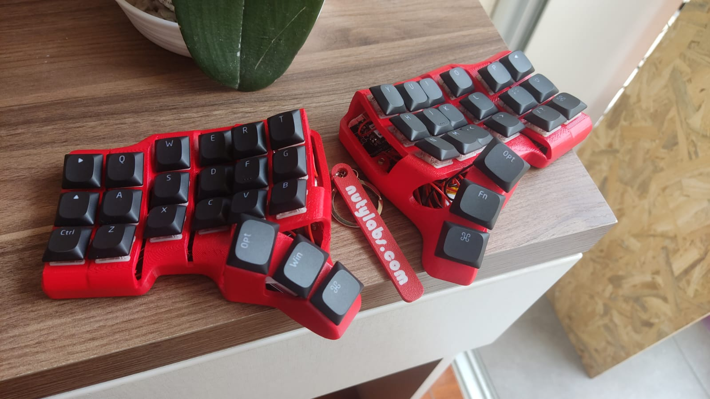

# TBK mini ZMK Port, by Nuty L.A.B.S.
This is a ZMK port for a TBK mini. It uses the XIAO BLE microcontroller, and our XIAOntegrated PCB

## Features
- Bluetooth support
- 42 programable buttons
- USB HID support on the left side
- ZMK studio compatible

  
## Changing the keymap 

Edit the file config/tbkminixiao.keymap. The list of available keycodes can be found here https://zmk.dev/docs/keymaps/list-of-keycodes

Our guide in spanish can be found here https://1drv.ms/w/c/307d4ed910caa55c/EdZAXYbGm21JrzpFKC9DZqIBkYD3zuWoswiTy45Ijfwd6Q?e=tsryHL

# To build it:

- Create a fork of this repo
- Enable GitHub Actions on your fork
- Everytime you make a commit, to any branch, a build will be triggered. You can find the results in the "Actions" tab of your forked repo.

